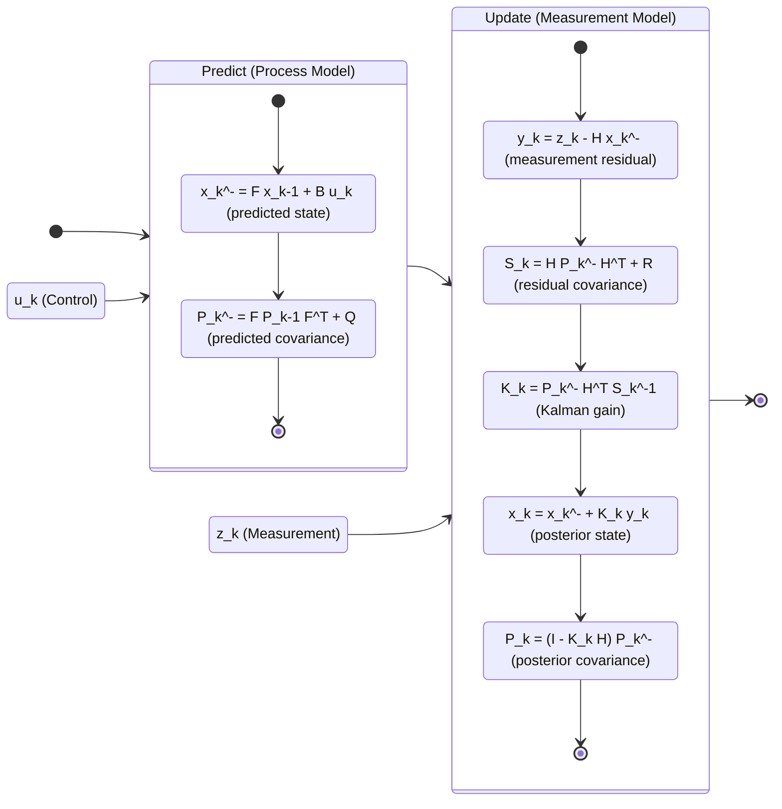

```mermaid
stateDiagram-v2
    direction LR

    [*] --> Predict
    Predict --> Update
    Update --> [*]

    state "u_k (Control)" as Uk
    state "z_k (Measurement)" as Zk
    Uk --> Predict
    Zk --> Update

    state "Predict (Process Model)" as Predict {
        [*] --> Xpred
        state "x_k^- = F x_k-1 + B u_k (predicted state)" as Xpred
        Xpred --> Ppred
        state "P_k^- = F P_k-1 F^T + Q (predicted covariance)" as Ppred
        Ppred --> [*]
    }

    state "Update (Measurement Model)" as Update {
        [*] --> Innov
        state "y_k = z_k - H x_k^- (measurement residual)" as Innov
        Innov --> Sk
        state "S_k = H P_k^- H^T + R (residual covariance)" as Sk
        Sk --> Kgain
        state "K_k = P_k^- H^T S_k^-1 (Kalman gain)" as Kgain
        Kgain --> Xpost
        state "x_k = x_k^- + K_k y_k (posterior state)" as Xpost
        Xpost --> Ppost
        state "P_k = (I - K_k H) P_k^- (posterior covariance)" as Ppost
        Ppost --> [*]
    }
```
