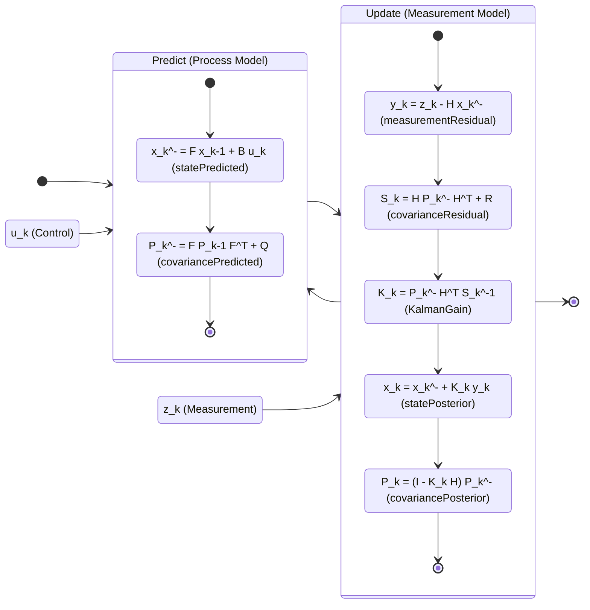

# KalmanCore README

A Swift package implementing various Kalman filtering algorithms and estimation techniques.

## Project overview
- KalmanCore is a Swift Package (swift-tools-version 6.1) providing numerical primitives, stochastic state-space models, observation models, and parameter-estimation algorithms (EM and Newton–Raphson MLE).
- Targets: a single library target KalmanCore and a test target KalmanCoreTests.
- Platforms: macOS 13+, iOS 16+, tvOS 16+, watchOS 9+.
- External dependencies: none declared in Package.swift; numerics rely on Apple’s Accelerate framework.


## For Basic Understanding: 
[Kalman Filter For Dummies](https://bilgin.esme.org/BitsAndBytes/KalmanFilterforDummies)

[KalmanFilter summary](https://www.bzarg.com/p/how-a-kalman-filter-works-in-pictures/)



## Features

- New in this release:
  - Linear Kalman Filter and Extended Kalman Filter with tests
  - Shared Linearization utilities (finite-diff F, H)
  - Likelihood utilities and Matrix utilities (Accelerate-backed with fallbacks)
  - EnKF–EM windowed estimator with diagnostics

### Core Components
- **Matrix Operations**: Optimized matrix algebra using Accelerate framework
- **Random Utilities**: Gaussian noise generation with covariance support
- **Ensemble Structures**: Ensemble representation for EnKF methods

### Stochastic Models 
[Section 2.1](SECTION_2_1.md)
Implementation of stochastic dynamical systems from Pulido et al. (2018):
- **Stochastic Dynamical System Protocol**: dx/dt = M(x, θ) + σ(x, θ)ξ(t)
- **Lorenz96 Model**: Classic chaotic system with multiple stochastic parameterization types
  - Additive noise: σ = θ₀·I
  - State-dependent noise: σᵢ = θ₀·|xᵢ|
  - Diagonal noise: σ = diag(θ)

### Observation Models
- **Observation Protocol**: y_k = H(x_k) + v_k
- **Linear Observation**: Full observation matrix support
- **Identity Observation**: Direct state observation
- **Partial Observation**: Observe subset of state variables

### Filters
- Kalman Filter (linear) — implemented
- Extended Kalman Filter (EKF) — implemented
- Unscented Kalman Filter (UKF) — implemented (scaled UT, non–square-root variant)
- Ensemble Kalman Filter (EnKF, augmented-state) — stochastic and square-root analysis paths; Schur (Gaspari–Cohn) localization (state–obs) for Identity/Partial obs; ongoing enhancements
- Particle Filter (SIR) — scaffold implemented (systematic/multinomial resampling)

### Estimation
- Expectation-Maximization (EM)
- Newton-Raphson Maximum Likelihood Estimation (MLE)
- EnKF–EM (windowed, additive-noise case) — see [Section 3.2](SECTION_3_2.md)

### Section 3 Documentation
- [Section 3.1](SECTION_3_1.md) Augmented-state EnKF (square-root + Schur localization)
- [Section 3.2](SECTION_3_2.md) EnKF–EM
- [Section 3.3](SECTION_3_3.md) EnKF–NR (stub)
- [Section 3.4](SECTION_3_4.md) UKF (brief notes)
- [Section 3.5](SECTION_3_5.md) Particle Filter (brief notes)

### Examples
- Lorenz96 system demonstrations
- Stochastic parameterization identification

## Installation

### Swift Package Manager

Add KalmanCore to your `Package.swift`:

```swift
dependencies: [
    .package(url: "https://github.com/dndydon/KalmanCore.git", from: "1.0.0")
]
```

Or add it in Xcode via File → Add Package Dependencies.

## Requirements

- Swift 5.9+
- macOS 13.0+ / iOS 16.0+ / tvOS 16.0+ / watchOS 9.0+

## Usage

### Using KF/EKF/UKF
- Linear KF
```swift
import KalmanCore

let F = Matrix.identity(size: 2)
let Q = Matrix.identity(size: 2) * 0.01
let H = Matrix.identity(size: 2)
let R = Matrix.identity(size: 2) * 0.1

let kf = KalmanFilter(F: F, Q: Q, H: H, R: R, x0: [0.0, 0.0], P0: Matrix.identity(size: 2))
let (state1, res1) = kf.step(y: [1.0, -1.0])
print("KF state:", state1.x, "LL+:", res1.logLikelihoodIncrement)
```
- Extended KF (nonlinear models)
```swift
import KalmanCore

let model = Lorenz96Model.standard(stochasticType: .additive)
let n = model.stateDimension
let obs = IdentityObservationModel(dimension: n, noiseVariance: 1e-2)

let ekf = ExtendedKalmanFilter(
  model: model,
  observationModel: obs,
  initialState: model.typicalInitialState(),
  initialCovariance: Matrix.identity(size: n) * 0.1,
  parameters: [0.3],
  dt: 0.01
)
let y = obs.generateObservation(state: ekf.state.x)
let (state2, res2) = ekf.step(y: y)
print("EKF state:", state2.x.prefix(3), "LL+:", res2.logLikelihoodIncrement)
```

- UKF (non–square-root) and Particle Filter (SIR)
```swift
import KalmanCore

let model = Lorenz96Model.standard(stochasticType: .additive)
let n = model.stateDimension
let obs = IdentityObservationModel(dimension: n, noiseVariance: 1e-2)

var ukf = UnscentedKalmanFilter(model: model,
                                observationModel: obs,
                                initialState: model.typicalInitialState(),
                                initialCovariance: Matrix.identity(size: n) * 0.2,
                                parameters: [0.3],
                                dt: 0.01)
let y = obs.generateObservation(state: ukf.state.x)
let (_, ukfRes) = ukf.step(y: y)
print("UKF LL+:", ukfRes.logLikelihoodIncrement)

var pf = ParticleFilter(model: model,
                        observationModel: obs,
                        x0: model.typicalInitialState(),
                        P0: Matrix.identity(size: n) * 0.2,
                        parameters: [0.3],
                        dt: 0.01,
                        config: .init(numParticles: 200))
let (_, pfRes) = pf.step(y: y)
print("PF ESS:", pfRes.ess)
```

### Section 2.1: Stochastic Parameterization

```swift
import KalmanCore

// Create a Lorenz96 model with stochastic parameterization
let model = Lorenz96Model.standard(stochasticType: .additive)

// Define initial state and parameters
let initialState = model.typicalInitialState()
let parameters = [0.5]  // Stochastic noise level θ₀

// Simulate stochastic trajectory
let trajectory = model.simulateTrajectory(
    initialState: initialState,
    parameters: parameters,
    dt: 0.01,
    steps: 1000
)

// Create ensemble for EnKF
let ensemble = Ensemble(
    mean: initialState,
    covariance: Matrix.identity(size: 40) * 0.1,
    ensembleSize: 50
)

// Forecast ensemble forward
let forecast = model.forecastEnsemble(
    ensemble: ensemble,
    parameters: parameters,
    dt: 0.01
)

// Create observation model (observe every other variable)
let observedIndices = stride(from: 0, to: 40, by: 2).map { $0 }
let obsModel = PartialObservationModel(
    stateDimension: 40,
    observedIndices: observedIndices,
    noiseVariance: 0.5
)

// Generate observation
let observation = obsModel.generateObservation(state: initialState)

// Run demonstrations
Lorenz96Demo.runAll()
```

### Section 3: Sequential Parameter Estimation (EnKF–EM)
See [Section 3.2](SECTION_3_2.md) for the algorithm outline and a minimal usage example combining the augmented-state EnKF with an EM M-step in the additive-noise case.

## How to run the EnKF benchmark

The package includes a micro-benchmark executable to sanity-check EnKF performance across modes and ensemble sizes.

Quick start
```bash
swift run enkf-bench
```

Optional environment variables
- ENKF_BENCH_N: state dimension (default 40)
- ENKF_BENCH_STEPS: number of forecast/analysis steps (default 50)
- ENKF_BENCH_ENSEMBLES: comma-separated ensemble sizes (default 10,20,40)
- ENKF_BENCH_LOCALIZE: true/false (default false)
- ENKF_BENCH_SQRT: true/false (default true)

Examples
```bash
# Default run
swift run enkf-bench

# Localized, square-root analysis, multiple ensemble sizes
ENKF_BENCH_LOCALIZE=true ENKF_BENCH_SQRT=true ENKF_BENCH_ENSEMBLES=10,20,40 swift run enkf-bench

# Larger state and more steps
ENKF_BENCH_N=80 ENKF_BENCH_STEPS=100 swift run enkf-bench
```

See also: benchmarks/README.md for notes.

## License

[LICENSE](blob/master/LICENSE.txt)

## Contributing

Contributions are welcome! Please feel free to submit a Pull Request.
